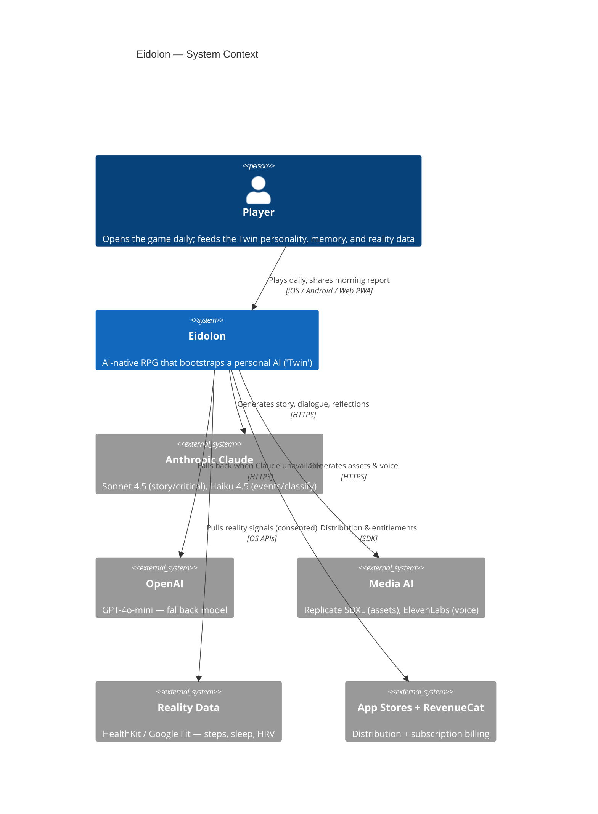
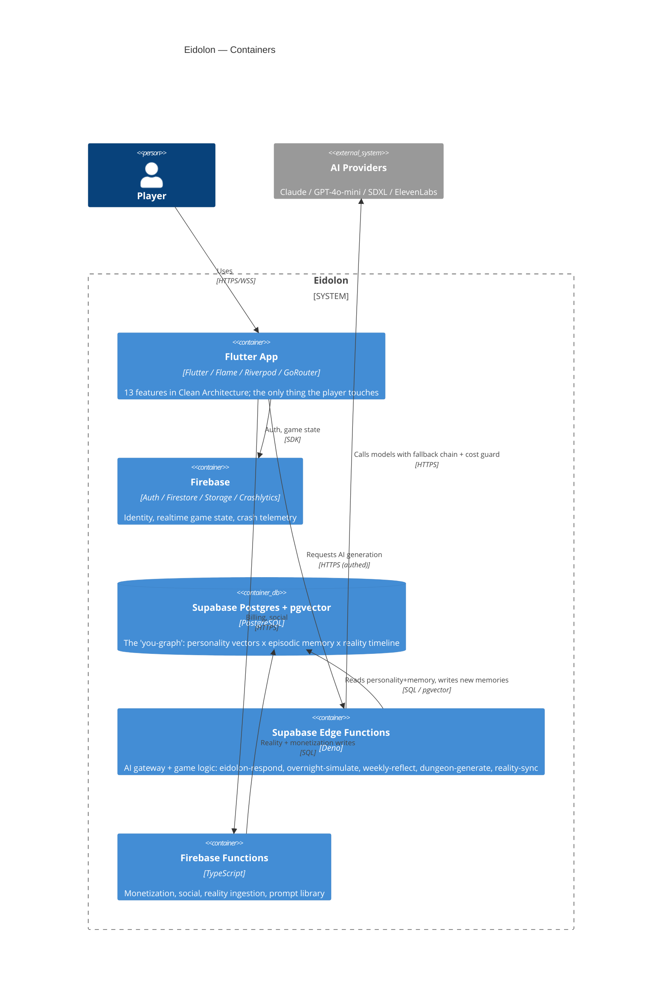
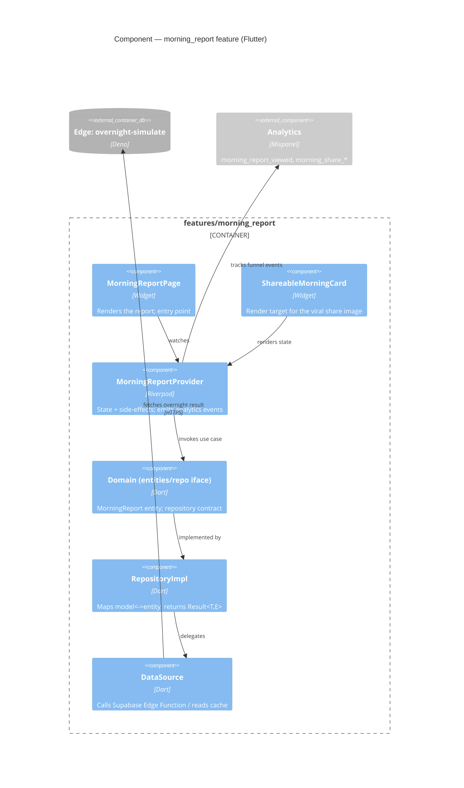
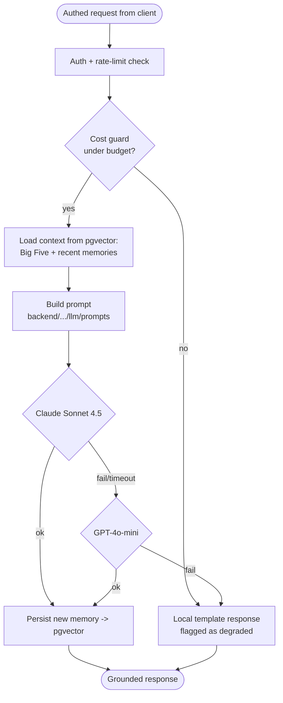
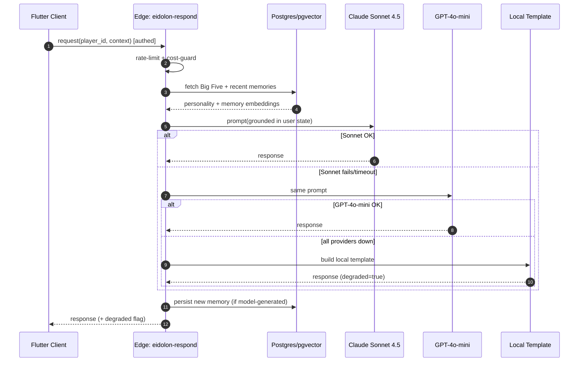
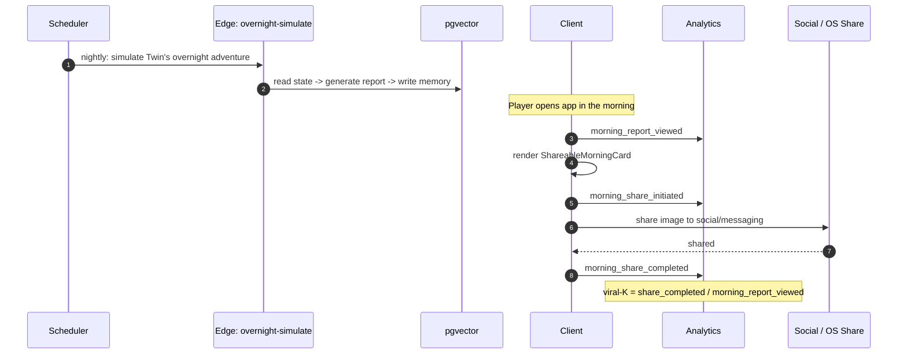
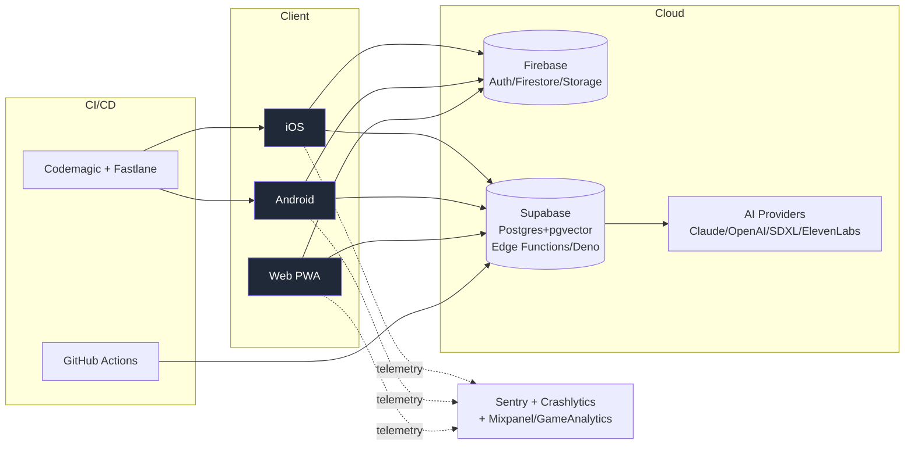

# Eidolon — Architecture Deep-Dive (C4 + Sequences)

> Companion to the [Case Study](./CASE_STUDY.md). This document is for the reader who wants to
> verify the system is *designed*, not assembled — a CTO deciding if they'd trust the design, and
> a VC checking the moat is real infrastructure, not a slide.
>
> Every box below maps to something in the tree (`apps/mobile/lib/`, `backend/supabase/functions/`,
> `backend/functions/src/`). Where the running system diverges from
> [`docs/ARCHITECTURE.md`](../docs/ARCHITECTURE.md), this document describes **what is actually
> built** and says so — see [§6 Divergences](#6-divergences-doc-vs-tree).

---

## 1. C4 Level 1 — System Context

**Read this for:** the boundary. The player only ever talks to Eidolon. No AI provider, key, or bill
is reachable from the client — that boundary is enforced one level down.

---

## 2. C4 Level 2 — Containers

**The two decisions an architect should notice:**

1. **Supabase Edge Functions are the AI gateway.** Every model call is server-side, authed, and
   wraps the fallback chain + cost guard. The Flutter client holds no model keys. (The original doc
   placed this in a Cloudflare Worker; the tree implements it in Edge Functions — §6.)
2. **pgvector is a first-class container, not a cache.** The moat ("you-graph") is queryable
   infrastructure: every Eidolon prompt is grounded by reading the player's personality + recent
   memories out of Postgres before the model is called.

---

## 3. C4 Level 3 — Components

### 3a. Flutter feature (Clean Architecture) — `morning_report`

Representative of all 13 features; the dependency rule points inward (presentation → domain ← data).

**Why it matters:** the dependency rule is enforced — `domain` depends on nothing; `data` and
`presentation` depend on `domain`. Errors cross boundaries as typed `Result<T,E>`, not exceptions.
This is the contract repeated across all 13 features (CLAUDE.md), which is *why* the codebase scales.

### 3b. AI Gateway components — `eidolon-respond` Edge Function

**Why it matters:** the fallback chain is a *component-level* design, and the terminal fallback is a
local template that **declares itself degraded** — covered by the "fallback honesty invariant" test
(`b655b25`). Truthfulness is treated as a system property, not a vibe.

---

## 4. Key Sequences

### 4a. Grounded AI response with graceful degradation

The **`degraded` flag** flows back to the client so the UI can be honest with the user. That is the
behavior the honesty-invariant test protects.

### 4b. The morning-report viral loop (the instrumented growth engine)

**Why it matters:** the growth loop isn't hoped for — it's a measured funnel
(`morning_report_viewed → morning_share_initiated → morning_share_completed`), instrumented in commit
`62400cd`. A VC can ask "what's your K?" and the events to answer already exist.

---

## 5. Deployment

CI-checked governance invariants (`docs/governance/state/current_state.test.ts`) run in GitHub
Actions — the constitution is enforced on every push, not just documented.

---

## 6. Divergences (doc vs. tree)

Stating these *is* the senior move — it shows the diagrams were drawn from the code, not the wishlist.

| [`docs/ARCHITECTURE.md`](../docs/ARCHITECTURE.md) says | The tree actually has | Why / plan |
|---|---|---|
| Cloudflare Worker as the LLM proxy | Supabase **Edge Functions (Deno)** as the AI gateway | Edge Functions co-locate with pgvector (the grounding data), removing a network hop. Recorded in [ADR-003](../docs/DECISIONS/ADR-003-ai-gateway-edge-functions.md); `docs/ARCHITECTURE.md` v0.1 still needs the box updated. |
| "Flame Engine" front-and-center | Flame present; most shipped value is in feature UIs + AI loops | The wedge→Twin pivot ([STRATEGY.md](../docs/strategy/STRATEGY.md)) shifted effort from combat to the bond/reflection loop — diagrams reflect that. |

> These diagrams are anchored to the repository as it stands. They will be kept in sync as the
> Act-1 launch lands; divergences are tracked here rather than hidden.
